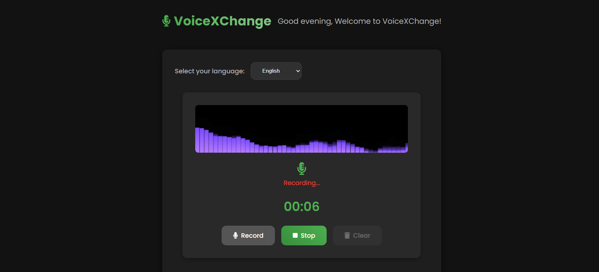
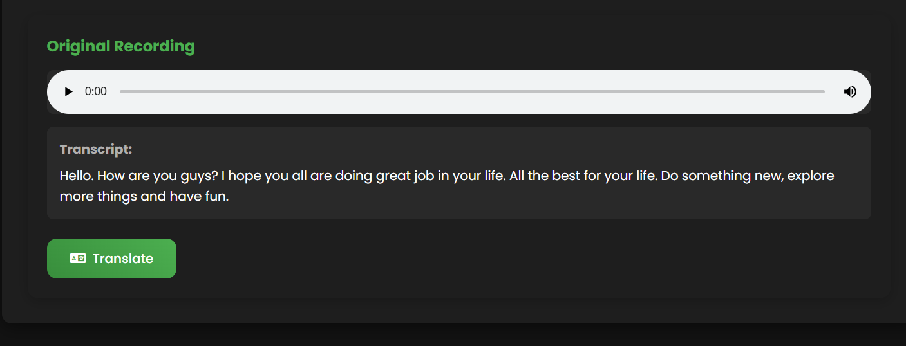
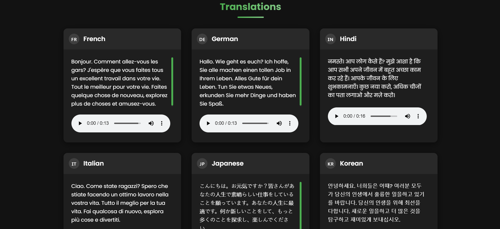
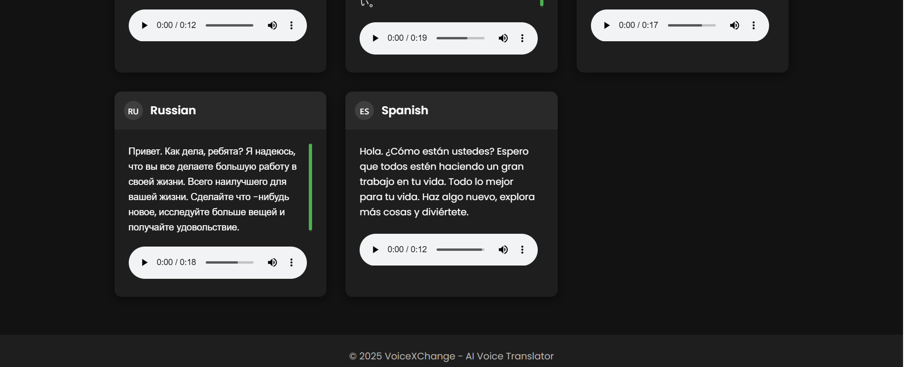

# 🎙️ VoiceXChange - Real-Time AI Speech Translator  

**VoiceXChange** is a sleek, modern, and intuitive web application designed to break language barriers through real-time speech translation. Powered by advanced AI services, VoiceXChange lets users:

- 🎙️ Record their voice directly from the browser  
- ✍️ Convert speech into text using cutting-edge transcription technology  
- 🌍 Translate the text into multiple global languages  
- 🔊 Playback the translated content using lifelike synthesized voice  

Whether you're a traveler, language learner, content creator, or simply someone looking to explore multilingual communication, **VoiceXChange** delivers a seamless and interactive experience with:

- 🔄 **Real-time voice-to-voice translation**  
- 🌐 **Support for 7+ major world languages**  
- 🎧 **Instant audio playback** for both original and translated phrases  
- 📱 **Responsive and elegant UI** optimized for both desktop and mobile devices  

The application integrates state-of-the-art APIs and modern web technologies to deliver fast, accurate, and user-friendly translations—all wrapped in a visually appealing dark theme.


---

> 🌐 **Live Demo**: [Visit VoiceXChange](https://ai-voice-translator-3.onrender.com/)
---
> **🌐 Try VoiceXChange in Action**


## 📸 How It Works

### 1. 🎤 Voice Input
Capture your voice in real-time through an intuitive recording interface.



### 2. 📄 Translation & Transcription
Your speech is transcribed using AssemblyAI and translated using Google Translate.



### 3. 🔊 Voice Output
Translated text is converted back to speech using gTTS.



---

## ✨ Key Features

- **🎤 Voice Capture**: Record your voice effortlessly with real-time waveform animations  
- **📝 Instant Transcription**: Powered by AssemblyAI’s cutting-edge speech recognition  
- **🌍 Multi-Language Translation**: Currently supports translation between 7 global languages:  
  - English 🇬🇧  
  - Hindi 🇮🇳  
  - Japanese 🇯🇵  
  - Spanish 🇪🇸  
  - Russian 🇷🇺  
  - German 🇩🇪  
  - Korean 🇰🇷  
- **🔊 Speech Playback**: Listen to both the original and translated outputs  
- **📱 Mobile-Friendly UI**: Designed to be fully responsive on both desktop and mobile  
- **🎨 Visually Appealing**: Sleek dark theme with smooth transitions and dynamic elements  

> 🗂️ Each translation appears as a stylized card with playback and text preview

---

## 🚀 Setup Instructions

### ✅ Prerequisites

- Python 3.8 or higher  
- Node.js + npm (for frontend tools)  
- API key from AssemblyAI  

### 🔧 Installation Steps

Clone the repository:

```bash
git remote set-url origin https://github.com/aritrraa/AI-VOICE-TRANSLATOR.git

cd AI-Voice-Translator
```

Create and activate a virtual environment:

```bash
python -m venv venv
source venv/bin/activate  # For Windows: venv\Scripts\activate
```

Install Python dependencies:

```bash
pip install -r requirements.txt
```

Create a `.env.local` file with your API credentials:

```
ASSEMBLYAI_API_KEY=your_assemblyai_api_key
```

---

### ▶️ Run the App

Start the Flask server:

```bash
python app.py
```

Then open your browser and go to:

```
http://localhost:5000
```


---

## ☁️ Deployment Summary (via Render)

I have successfully deployed this project using [Render](https://ai-voice-translator-3.onrender.com/). Below are the essential steps followed:

1. **Pushed the code** to a GitHub repository.
2. **Connected the repository** to Render by creating a new Web Service.
3. **Configured the service** with the following settings:
   - **Environment**: Python 3.8+
   - **Build Command**:  
     ```bash
     pip install -r requirements.txt
     ```
   - **Start Command**:  
     ```bash
     python app.py
     ```
4. **Added required environment variables**, including API keys for services like Gemini and Groq.
5. **Render handled the deployment automatically**, and the app is now live and accessible via a Render-provided URL.

---

## 🛠️ Tech Stack

### Backend:
- **Flask** — Python micro web framework  
- **AssemblyAI** — Real-time speech-to-text conversion  
- **Google Translate API** — For multilingual text translations  
- **gTTS (Google Text-to-Speech)** — Converts translated text to spoken audio  

### Frontend:
- **HTML5 & CSS3** — Core structure and styling  
- **JavaScript** — Frontend interactivity  
- **MediaRecorder API** — Microphone audio capture  
- **Web Audio API** — Waveform rendering & visualization  

---

## 📁 Directory Overview

```
├── app.py                 # Main Flask backend
├── static/
│   ├── script.js          # Client-side JS logic
│   └── styles.css         # Application styling
├── templates/
│   └── index.html         # Web interface
├── .env.local             # Configuration file (not included)
└── README.md              # Project overview (this file)
```

---

## 🔐 Privacy & Data Handling

- Voice recordings are **temporarily processed on the server**
- Transcriptions are securely handled by **AssemblyAI**
- All temporary audio files are **automatically deleted within 24 hours**

---

## 📄 License

This project is open-source under the **MIT License**. Refer to the `LICENSE` file for more details.

---

## 🙌 Credits & Tools

- [AssemblyAI](https://www.assemblyai.com/) for speech recognition  
- [Google Translate](https://translate.google.com/) for translations  
- [Font Awesome](https://fontawesome.com/) for UI icons  
- [Google Fonts](https://fonts.google.com/specimen/Poppins) for typography  

---


## 🙏 Acknowledgements

We are incredibly thankful for the following tools and services that made **VoiceXChange** possible:

- **[AssemblyAI](https://www.assemblyai.com/)** – For providing powerful and accurate speech-to-text capabilities  
- **[Google Translate API](https://cloud.google.com/translate)** – For enabling fast and multilingual text translation  
- **[gTTS (Google Text-to-Speech)](https://pypi.org/project/gTTS/)** – For turning translated text into natural-sounding speech  
- **[Font Awesome](https://fontawesome.com/)** – For the extensive and visually rich collection of icons used in the UI  
- **[Poppins Font](https://fonts.google.com/specimen/Poppins)** – A clean and modern typeface that enhances UI readability  
- **[Flask](https://flask.palletsprojects.com/)** – A lightweight and flexible backend framework that powers the server logic  
- **[JavaScript Web APIs](https://developer.mozilla.org/en-US/docs/Web/API)** – For enabling audio recording, visualization, and real-time browser interactions  

Special thanks to all open-source contributors, API providers, and developer communities for enabling such innovative projects to thrive.

## 🚧 Future Improvements

- 🌐 Add more supported languages  
- 🎙️ Custom voices per language  
- 💾 Download or save translated outputs  
- 🔐 User login system with translation history  
- 📶 Offline mode with caching and fallback support

## 👤 Author
- Developed by Aritra Das
